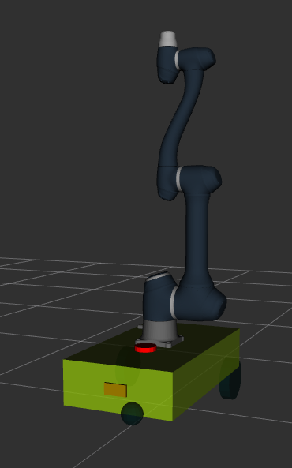

# Sakar Bot 



*Autonomous mobile robot for warehouse logistics and material handling*

## 📋 Table of Contents
- [Overview](#overview)
- [Assignment Requirements](#assignment-requirements)
- [Features](#features)
- [Installation](#installation)
- [Quick Start](#quick-start)
- [Launch Files](#launch-files)
- [Technical Details](#technical-details)
- [System Architecture](#system-architecture)
- [Troubleshooting](#troubleshooting)
- [Future Work](#future-work)

## 🚀 Overview

This project implements a complete mobile manipulation system for ROS2 Humble as part of the technical assignment. The system demonstrates autonomous navigation, mapping, and mock pick-and-place operations in a warehouse environment.

## 📋 Assignment Requirements Fulfilled

### ✅ Mobile Manipulator Integration
- Custom URDF robot model with mobile base
- Industrial warehouse environment simulation
- Modular robot description for future arm integration

### ✅ Mission Control System
- **Finite State Machine** implementation in C++
- Complete mission lifecycle management
- Nav2 integration for autonomous navigation

### ✅ Real-World Edge Case Handling
- Navigation timeout detection and recovery
- Service failure handling with retry logic
- Graceful state transitions and error recovery

### ✅ Sensor Integration
- LiDAR for navigation and mapping
- Camera setup for vision
- RTAB-Map for SLAM and localization
- IMU data from robot 

## ✨ Features

- **🤖 Autonomous Navigation**: Nav2  for robust path planning
- **🗺️ 2D SLAM**: RTAB-Map for real-time mapping and localization
- **📦 Mission Automation**: Complete pick-and-drop operations with mock manipulation
- **🏭 Warehouse Simulation**: Realistic Gazebo environment
- **🔧 Modular Design**: Easy to extend for actual manipulator integration

## 📥 Installation

### Prerequisites
- Ubuntu 22.04
- ROS2 Humble
- Gazebo (Classic) 

### Clone and Build
```bash
# Clone the repository
git clone https://github.com/your-username/sakar_bot_ws.git
cd sakar_bot_ws

# Build the workspace
colcon build --symlink-install

# Source the workspace
source install/setup.bash
```
### **Build Dependencies**
```bash
# Common missing dependencies
sudo apt update
sudo apt install ros-humble-nav2-*
sudo apt install ros-humble-rtabmap-*
```
## 🎯 Quick Start

### 1. Launch Simulation Environment
```bash
ros2 launch sakar_bot gazebo.launch.py
```
*Launches Gazebo with warehouse world and robot model*

### 2. RTAB-Map Configuration

#### Mapping Mode (SLAM)
```bash
ros2 launch sakar_bot rtab_map.launch.py localization:=false
```
- Deletes previous database and creates new map
- Uses laser scans for 2D mapping
- Optimized for warehouse environments

#### Localization Mode
```bash
ros2 launch sakar_bot rtab_map.launch.py localization:=true
```
- Uses existing map database for localization only
- Maintains consistent pose estimation
- No mapping overhead

### 3. Launch Navigation
```bash
ros2 launch sakar_bot navigation.launch.py
```
*Starts Nav2 stack with RViz visualization*

### 4. Execute Mission
```bash
ros2 launch sakar_bot mission_planner.launch.py
```
*Runs automated pick-and-drop mission*

## 🔄 Mission Sequence

### Detailed State Flow:

1. **SPAWN_BOX** 
   - Places cargo parcel at pick location using Gazebo spawn service

2. **NAV_TO_PICK** 
   - Sends navigation goal to pick location using Nav2 action
   - Monitors progress through odometry feedback

3. **MONITOR_NAV_PICK**
   - Continuously checks distance to goal
   - Implements timeout detection (60 seconds default)
   - Uses goal tolerance (0.5m default) for arrival detection

4. **MOCK_PICK**
   - **Simulates manipulator operation** - deletes ground box
   - In real implementation, this would trigger MoveIt2 arm trajectory

5. **SPAWN_ATTACHED**
   - Spawns box entity attached to robot (visual representation)

6. **NAV_TO_DROP**
   - Navigates to drop location with attached cargo

7. **MONITOR_NAV_DROP**
   - Same monitoring logic as pick navigation

8. **MOCK_DROP**
   - **Simulates placement operation** - deletes attached box
   - Would be replaced with actual manipulator placement

9. **SPAWN_DROP**
   - Spawns box at drop location to simulate delivered cargo

10. **NAV_HOME**
    - Returns robot to home position

11. **MONITOR_NAV_HOME**
    - Final navigation monitoring phase

12. **DONE** → **IDLE**
    - Mission completion and state reset

## 🔧 Technical Architecture

### Core Components

#### 1. **Robot Model**
- **URDF/Xacro**: Modular robot description with sensor configurations
- **Sensors**: 2D LiDAR for navigation, IMU for odometry
- **Differential Drive**: Skid-steer configuration for mobile base

#### 2. **Navigation Stack**
- **Planner**: Smac Planner for global path planning
- **Controller**: Model Predictive Controller for local trajectory
- **Recovery Behaviors**: Spin and backup for stuck situations

#### 3. **Mission Planner (Finite State Machine)**
- **14-State FSM**: Comprehensive mission management
- **Action Clients**: Nav2 `NavigateToPose` action interface
- **Service Clients**: Gazebo spawn/delete entity services
- **Parameter System**: Configurable mission parameters


#### Mission Parameters 
```cpp
pick_x: 4.4774699211120605      // Pickup location X
pick_y: 1.5526522397994995      // Pickup location Y  
drop_x: -3.905107259750366      // Drop location X
drop_y: 0.8089179992675781      // Drop location Y
home_x: 0.0                     // Home position X
home_y: 0.0                     // Home position Y
goal_tolerance: 0.5             // Navigation tolerance (meters)
nav_timeout: 60.0               // Navigation timeout (seconds)
```

## 🗂️ Project Structure

```
sakar_bot_ws/
├── src/sakar_bot/
│   ├── launch/                 # ROS2 launch files
│   │   ├── gazebo.launch.py    # Simulation environment
│   │   ├── navigation.launch.py # Nav2 stack
│   │   ├── rtab_map.launch.py  # SLAM/Localization
│   │   └── mission_planner.launch.py
│   ├── missions/               # C++ mission planner
│   │   └── mission_planner.cpp # Finite State Machine
│   ├── urdf/                   # Robot description
│   │   ├── sakar.urdf.xacro    # Main robot model
│   │   ├── mobile_base.xacro   # Base configuration
│   │   └── camera.xacro        # Sensor configurations
│   ├── config/                 # Configuration files
│   │   └── nav2_params.yaml    # Navigation parameters
│   ├── models/                 # Gazebo models
│   │   ├── warehouse_models/   # Environment assets
│   │   └── box.sdf             # Cargo model
│   ├── world/                  # Simulation worlds
│   │   └── warehouse.world     # Warehouse environment
│   └── rviz/                   # Visualization configs
│       └── nav2_default_view.rviz
├── images/                     # Documentation images
└── videos/                     # Demo videos
```

### 1. **Gazebo Model Loading Issues**
```bash
# Set model path explicitly
export GAZEBO_MODEL_PATH=$PWD/src/sakar_bot/models:${GAZEBO_MODEL_PATH}
```

### 2. **RTAB-Map Database Corruption**
```bash
# Reset mapping database
rm ~/.ros/rtabmap.db
```

### 3. **Navigation Failures**
- Verify costmap parameters in `nav2_params.yaml`
- Check transform tree in RViz (TF frames)
- Ensure laser scan data is being published

### 4. **Mission Planner Service Timeouts**
- Confirm Gazebo services are running: `ros2 service list | grep gazebo`
- Check navigation action server: `ros2 action list`

### 5. **Gazebo Classic EOL Considerations**
- This project uses Gazebo Classic ( EOL)
- Future migration to Ignition Gazebo recommended
- Current implementation tested on ROS2 Humble + Gazebo 11

## 🔮 Future Work & Production Enhancements

### Immediate Improvements
- [ ] **Actual Manipulator Integration**: Replace mock operations with MoveIt2
- [ ] **Real Pick/Place**: Implement gripper control and object detection
- [ ] **Dynamic Object Recognition**: Camera-based cargo identification

### Advanced Features
- [ ] **Multi-robot Coordination**: Fleet management system
- [ ] **Task Queueing**: Handle multiple pick/place requests
- [ ] **Energy-aware Navigation**: Battery monitoring and recharge behaviors
- [ ] **Safety Zones**: Dynamic obstacle avoidance with safety margins


## 📄 License

This project is licensed under the MIT License - see the [LICENSE](LICENSE) file for details.

---

